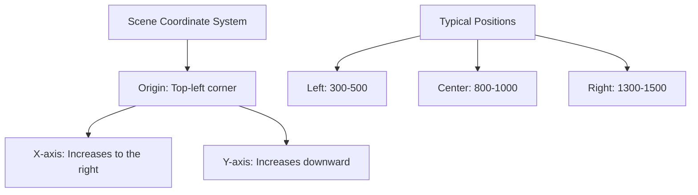

# Actor Coordinate and Scaling

## Scene Coordinate System

In dialogues, the actor's coordinates determine their position relative to the scene. The origin is at the top-left corner, with the X-axis increasing to the right and the Y-axis increasing downward.

## Actor's scaling

The actor's scaling determines their size in the scene. The origin is at the top-left corner, with the X-axis increasing to the right and the Y-axis increasing downward.

## Resolution reference

The coordinate (position) and scaling of actors are relative rather than absolute to adapt to devices with different resolution ratios. Therefore, a unified resolution ratio should be determined as a reference in the project, and the actor's coordinates and scaling should be set according to that ratio.

It is recommended to use `1920x1080` as the reference resolution ratio, which can accommodate different devices such as computers and mobile phones.

If your target device's resolution is fixed (such as some game console devices), then you can use that resolution as a reference without considering other devices.
